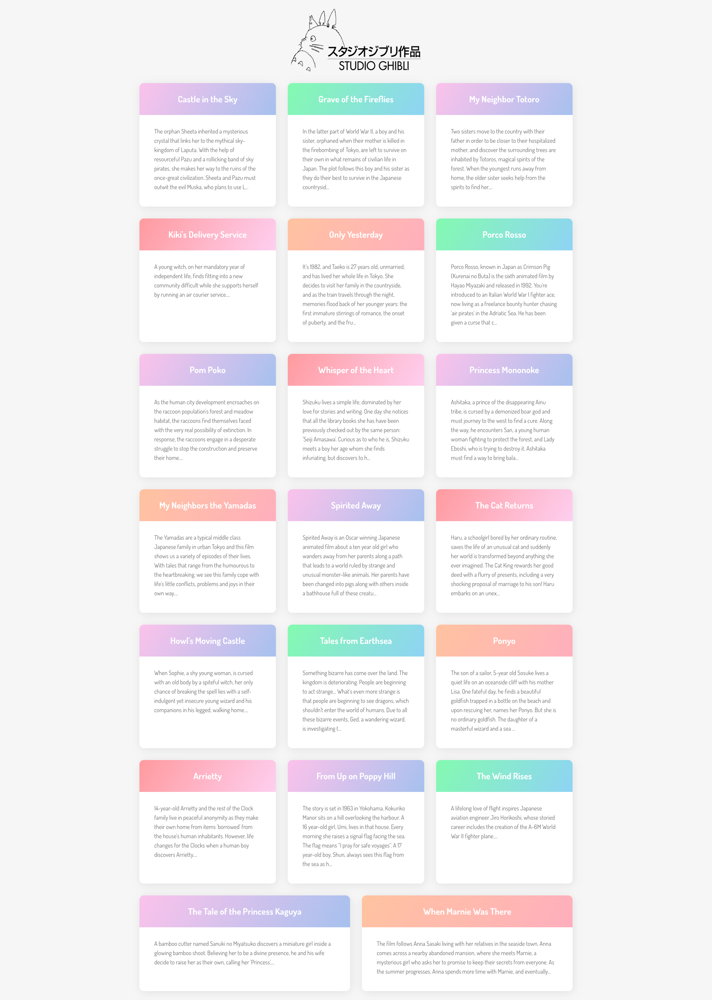

# COMET INTERNSHIP TEST

There are some bugs in the current code 

  - Logo seems broken
  - It's not showing any list
  - There's an error instead

# Features

  - Fetch all movie from the following API : https://ghibliapi.herokuapp.com/films
  - Display nicely in a grid such as image below
  - Display the logo on the top

# Expected Results
  